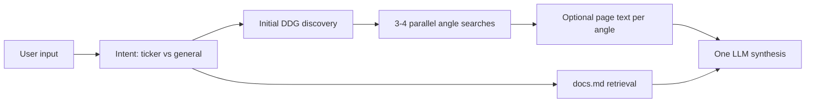

# Pydantic AI Deep Research Agent

A **multi-step research** pipeline built with **pydantic-ai**: **DuckDuckGo** discovery and parallel “angle” searches, optional **HTTP page extracts**, **retrieval from a local `docs.md`**, and a single **LLM pass** that returns a structured markdown report with citations. You can run it as a **CLI** (`main.py`) or a **Gradio** chat UI (`app.py`).

## Prerequisites

- **Python 3.10+** (e.g. `str | None` syntax).
- **`OPENAI_API_KEY`** in the environment or a root **`.env`** file.
- **Network access** for `ddgs` (DuckDuckGo) and optional fetches via **`httpx`**.

## Project structure

```text
pydantic/
├─ main.py          # CLI: args, .env, KnowledgeBase, runs async deep research, prints report
├─ app.py           # Gradio ChatInterface: same research stack, browser UI (default share=True)
├─ agent.py         # Intent (query vs ticker), discovery + parallel angle passes, calls the LLM
├─ tools.py         # KnowledgeBase (chunked docs.md), DDG search, async page text fetch
├─ prompts.py       # System prompt + `build_research_prompt` (report sections, citation rules)
├─ docs.md          # Optional local knowledge base (large file is fine; missing file = web-only)
├─ requirements.txt
└─ .env             # Create locally (not committed); see Setup
```

The folder `Pydantic-AI---Chatbot/` (if present) is a separate nested project and is **not** used by `main.py` or `app.py`.

## Setup

1) Create and activate a virtual environment:

```powershell
python -m venv .venv
.\.venv\Scripts\Activate.ps1
```

2) Install dependencies:

```powershell
pip install -r requirements.txt
```

Key packages: **`pydantic`**, **`pydantic-settings`**, **`pydantic-ai`**, **`python-dotenv`**, **`ddgs`**, **`httpx`**, **`gradio`** (for `app.py` only).

3) Create a **`.env`** in the project root, for example:

```env
OPENAI_API_KEY=your_key_here
OPENAI_MODEL=openai:gpt-4.1-mini
DOCS_PATH=docs.md
MAX_CONTEXT_CHARS=9000
```

| Variable | Purpose |
| -------- | ------- |
| `OPENAI_API_KEY` | **Required** for the OpenAI-backed model. |
| `OPENAI_MODEL` | PydanticAI model id (default in code: `openai:gpt-4.1-mini`). |
| `DOCS_PATH` | Path to local markdown for retrieval (default `docs.md`). |
| `MAX_CONTEXT_CHARS` | Max characters of `docs.md` context injected into the prompt (CLI `--max-context-chars` overrides). |

## Usage

### CLI (stdout)

**Free-text query**

```powershell
python main.py "Compare symbolic reasoning and chain-of-thought distillation for reliable AI systems."
```

**Stock-style ticker** (single token, `A`–`Z` only, 1–5 letters, optional dot suffix like `BRK.B`): the agent uses ticker-oriented search angles and a short company context pass.

```powershell
python main.py NVDA
```

**Interactive** (prompts if no args)

```powershell
python main.py
```

**Flags** (see `main.py`):

```powershell
python main.py "Your query" --docs-path docs.md --model openai:gpt-4.1-mini --max-context-chars 9000
```

### Gradio (browser)

```powershell
python app.py
```

This launches a **Chat** UI. By default the code uses `share=True` (temporary public Gradio link). Change `demo.launch(...)` in `app.py` if you want local-only or a fixed port.

## How it works



- **`main.py`** loads `.env`, requires `OPENAI_API_KEY`, builds `KnowledgeBase` and `AgentDeps`, then `asyncio.run`s `run_deep_research`.
- **`app.py`** loads the same env, builds the same agent/deps, and runs **`run_deep_research`** inside Gradio’s async handler.
- **`agent.py`** classifies **ticker** vs **general** query, runs an initial search, then **four parallel** angle bundles (search + up to two page fetches each), merges **`docs.md`** snippets, and runs the **Pydantic AI** agent once on the composed prompt.
- **`prompts.py`** asks the model for: **Executive Summary** → **angle-by-angle findings** with **`[URL | Source Title]`**-style evidence → **risks / conflicts** → **what to watch next** (5–8 bullets). The exact section titles in the model output may vary slightly; the system prompt enforces substance, not a rigid template.

## Quality and limitations

The system prompt steers the model toward **primary-style** evidence for financial claims when possible. **Search results and page extracts are not guaranteed complete or correct.** Use this as **research assistance**, not investment or legal advice; verify important facts yourself.

## Troubleshooting

- **Missing API key**: set `OPENAI_API_KEY` in `.env` or the environment (`main.py` raises a clear error; `app.py` fails on first chat when the model is called).
- **DuckDuckGo / `ddgs` errors**: check VPN/firewall, rate limits, or `pip install ddgs` in the active venv.
- **Page fetch failures**: some sites block scrapers; the report may rely more on search snippets.
- **Missing or huge `docs.md`**: index is built only if the file exists; retrieval is best-effort within `MAX_CONTEXT_CHARS`.
- **Model / billing errors**: confirm `OPENAI_MODEL` and your OpenAI account limits.

## Git note

An earlier version of this repo used a **single** `main.py` with an embedded **docs-only** Gradio Q&A (short answers from `docs.md` only). The current layout split that into a **web research** agent plus optional local docs. If you still need the old behavior, recover it with `git show HEAD:main.py` from a commit that predates the refactor.
